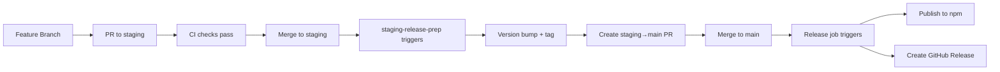
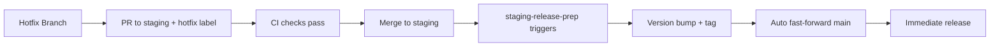

# Release Process Guide

This guide explains our automated release workflows and how contributors should work with them.

## Overview

We use a two-branch release system with full automation:

- **`staging`** - All feature work and release preparation happens here
- **`main`** - Only tracks published releases (deployment tracking)

## Release Workflows

### 1. Staging Release Preparation (`staging-release-prep.yml`)

**Trigger**: When a PR merges into `staging`

**What it does**:

1. **Analyzes changes** using OpenCode AI to determine release type (patch/minor/major)
2. **Bumps version** in `package.json` and `pnpm-lock.yaml`
3. **Creates annotated git tag** with auto-generated release notes
4. **Commits changes** with message `chore: release v{version}`
5. **Pushes tag** to GitHub
6. **Hotfix handling** - If PR has `hotfix` label, automatically fast-forwards `main`

**Key features**:

- **Semantic versioning** based on conventional commits and change analysis
- **Automatic release notes** generated by AI analysis
- **Hotfix fast-path** for critical fixes
- **No manual version bumping required**

### 2. Review Response Automation (`review-response.yml`)

**Trigger**: When someone comments on a PR review

**What it does**:

1. **Validates commenter** - Only runs for whitelisted users or repository members
2. **Creates fix branch** - Named `review/comment-{id}-{run-id}`
3. **Runs AI agent** - Uses OpenCode's `review-response` agent with `opencode/big-pickle` model
4. **Generates commit** - Single commit addressing the review comment
5. **Opens PR** - Back to the original PR's base branch

**Key features**:

- **Automated fixes** for review comments
- **Isolated branches** for each review response
- **AI-powered code generation** using the same tools as human developers
- **Traceable PRs** linking back to original review comments

## Release Flow

### Normal Release Process



### Hotfix Process



## Branch Rules

### `staging` Branch

- **All feature work** targets `staging`
- **Every merge** creates a release commit/tag
- **No direct commits** - only via PR merges
- **Release preparation** happens automatically

### `main` Branch

- **Deployment tracking only** - no direct development
- **Fast-forward merges only** from `staging`
- **Protected by** `main-merge-guard` workflow
- **Release commits** trigger npm publication

## Required Secrets

### `OPENCODE_API_KEY`

- **Used by**: `staging-release-prep` for release analysis
- **Create with**: `opencode auth token create --label "ci-release" --scopes responses.create`
- **Optional**: `OPENCODE_API_URL` for self-hosted endpoints

### `NPM_TOKEN`

- **Used by**: `release` job for publishing
- **Create with**: npm automation token from npmjs.com
- **Scope**: Must have publish permissions for `@openhax/codex`

## For Contributors

### How to Release Features

1. **Create feature branch** from `staging`
2. **Develop and test** your changes
3. **Open PR** to `staging` with clear description
4. **Address reviews** - AI will automatically help with review comments
5. **Merge to staging** - This automatically creates a release commit
6. **Create deployment PR** - `staging → main` (maintainers only)
7. **Merge to main** - This triggers npm publication

### Hotfix Process

1. **Create hotfix branch** from `staging`
2. **Fix the issue** and test thoroughly
3. **Open PR to staging** with `hotfix` label
4. **Merge to staging** - This automatically fast-forwards `main` and releases

### Review Comment Handling

- **Anyone can request changes** in PR reviews
- **AI automatically responds** to review comments from:
  - Repository members (`OWNER`, `MEMBER`, `COLLABORATOR`)
  - Whitelisted users (`coderabbitai`, `riatzukiza`)
- **Fix PRs are created** automatically with single commits
- **Human review** still required before merging fix PRs

## Local Development

### Testing Release Analysis

```bash
# Preview what release type will be generated
OPENCODE_API_KEY=your-key node scripts/detect-release-type.mjs --output release-analysis.json
cat release-analysis.json
```

### Syncing Secrets

```bash
# Export secrets locally
export NPM_TOKEN=your-npm-token
export OPENCODE_API_KEY=your-opencode-key

# Sync to repository (dry run first)
pnpm sync:secrets -- --dry-run
pnpm sync:secrets
```

## Troubleshooting

### Release Issues

- **Analyzer fails**: Check `OPENCODE_API_KEY` validity and network connectivity
- **Version conflicts**: Ensure only one release commit is queued at a time
- **Hotfix not promoting**: Verify `hotfix` label is applied before merge

### Review Response Issues

- **No response**: Check if commenter is in whitelist or has repository permissions
- **Wrong fixes**: Review the generated commit in the auto-created PR
- **Missing permissions**: Ensure workflow has `contents: write` and `pull-requests: write`

### Publishing Issues

- **npm 403**: Verify `NPM_TOKEN` has automation scope and package ownership
- **Tag conflicts**: Ensure tags are properly created in `staging-release-prep`

## Configuration

### Release Analysis Customization

- **Base reference**: Set `RELEASE_BASE_REF` to override diff starting point
- **Custom models**: Modify `scripts/detect-release-type.mjs` for different analysis
- **Release notes**: Edit the analyzer prompt to change note generation

### Workflow Permissions

- **Contents**: Write (for commits, tags, and releases)
- **Pull requests**: Write (for review response PRs)
- **Actions**: Read (for workflow triggers)

## Best Practices

1. **Conventional commits** help the analyzer determine correct release types
2. **Clear PR descriptions** improve release note quality
3. **Test thoroughly** before merging to `staging` - every merge creates a release
4. **Use hotfix label** sparingly for critical fixes only
5. **Monitor release PRs** to ensure correct versions and notes
6. **Keep secrets updated** and test them regularly

## Related Documentation

- [CI, Mutation Testing, and Release Automation](./development/ci.md) - Technical CI details
- [Architecture](./development/ARCHITECTURE.md) - Plugin architecture overview
- [Contributing Guidelines](../CONTRIBUTING.md) - General contribution process
- [Configuration](./configuration.md) - Plugin configuration options
