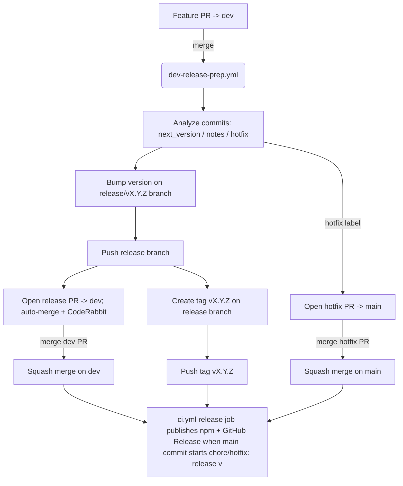

# Version-Bump Release Workflow Review

## Code References

- `.github/workflows/dev-release-prep.yml:59-229` – dev merge trigger builds release branch, bumps version, creates tag, and opens release/hotfix PRs.
- `.github/workflows/ci.yml:103-183` – release job gating on `main` push with `head_commit.message` starting `chore: release v`, publishes to npm and creates GitHub Releases.
- `scripts/detect-release-type.mjs:62-215` – analyzer output drives `nextVersion`/notes consumption in the staging release workflow.

## Existing Issues / PRs

- No open GitHub issues or PRs found for the current auto-bump release workflow. Prior specs: `release-pr-flow.md`, `release-automerge-and-tags.md`, `release-workflow-cli-failure.md` describe the current design but not the new breakages noted below.

## Findings

1. **Tags land before review/merge and stay off the released commit**
   - `dev-release-prep.yml:128-153` tags `v<next>` on the release branch before the PR is created/merged. Auto-merge uses squash, so the final commit on `dev`/`main` has a different SHA while the tag still points to the pre-squash branch commit. GitHub Release + npm publish (driven by that tag) no longer match the code that actually ships. Future `git describe` on `dev` also ignores that tag because it is not reachable, so release diffs are computed against an older tag.
2. **Release job often never runs (especially for hotfixes)**
   - `ci.yml:103-110` only runs the release job when a push to `main` has `head_commit.message` starting with `chore: release v`. Hotfix PRs opened from `dev-release-prep` use the title `hotfix: release v…` and squash merges on `main` generate commit messages that do not match the gate. Merge commits from `dev` also fail the prefix check. Result: no npm publish / GitHub Release even though the tag already exists.
3. **Tag/branch push is irreversible when PR creation fails**
   - `dev-release-prep.yml:142-153` pushes branch + tag before verifying PR creation succeeds (`curl` at :154-193). If the API call fails (quota/permissions), the repo is left with a published tag/version bump branch but no PR; auto-merge/review doesn’t run and manual cleanup is needed.

## Definition of Done

- Release automation tags the same commit that is merged into the protected branch (dev/main), avoiding off-SHA releases.
- Release publishing workflow triggers reliably for both normal and hotfix releases without relying on brittle commit-message prefixes.
- Failure to open release PR does not leave dangling tags/branches without review.

## Requirements / Next Steps

- Move tag creation/push after the release PR merges (or retag against the merge commit) so GitHub Releases and npm publish use the merged SHA.
- Rework release job trigger to react to `v*` tags (or version bumps) rather than `head_commit.message` prefixes; include hotfix commits.
- Gate pushing tags on successful PR creation (or implement cleanup on failure) to avoid dangling tags when GitHub API calls fail.

## Change Log

- 2025-11-20: Reordered dev release workflow to push the release branch and open the PR before tagging/pushing the tag; widened `ci.yml` release guard to allow `hotfix: release v` commits on `main`.
- 2025-11-20: Renamed default branch to `dev` in workflows/guards/auto-base; added ruleset drift check coverage for `dev`.

## Ruleset Review (2025-11-20)

- `release` ruleset (ID 10200441): applies to default branch (`refs/heads/dev`), enforces non-FF, deletion block, strict required checks (Lint & Typecheck, Test 20.x/22.x, CodeRabbit), Copilot review on push, CodeQL/code-quality gates.
- `main` ruleset (ID 10223971): applies to `refs/heads/main`, similar required checks but `strict_required_status_checks_policy` is false; allows merge/squash/rebase.
- Snapshots added to `.github/rulesets/{release.json,main.json}` with a README on how to refresh via `gh api`.

### Implications

- Dev release PRs must satisfy strict required checks; auto-merge should succeed once CodeRabbit + CI pass.
- Hotfix PRs into `main` rely on the `main` ruleset; strict status enforcement is off, so merging without all statuses passing remains possible unless GitHub auto-merge requires them. If we want parity, consider enabling strict required checks or folding `main` into the `release` ruleset targets.
- If we move to tag-triggered releases, ensure tags are created from the merged commit that satisfied the applicable ruleset (dev or main) to keep enforcement consistent with published artifacts.
- If we rename `dev` again, update the default branch and adjust workflows + `release` ruleset include target, then refresh snapshots.

## Flow Diagram

